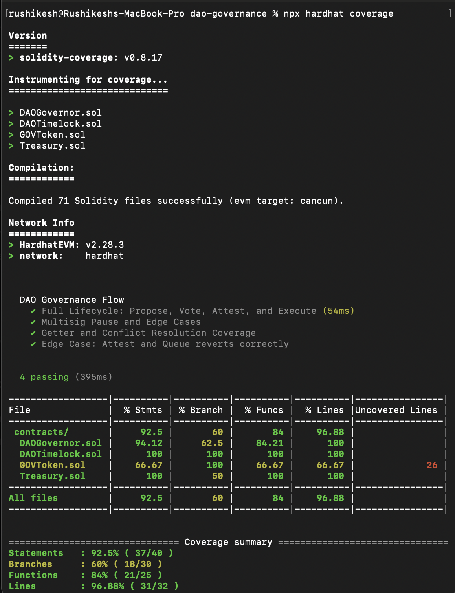
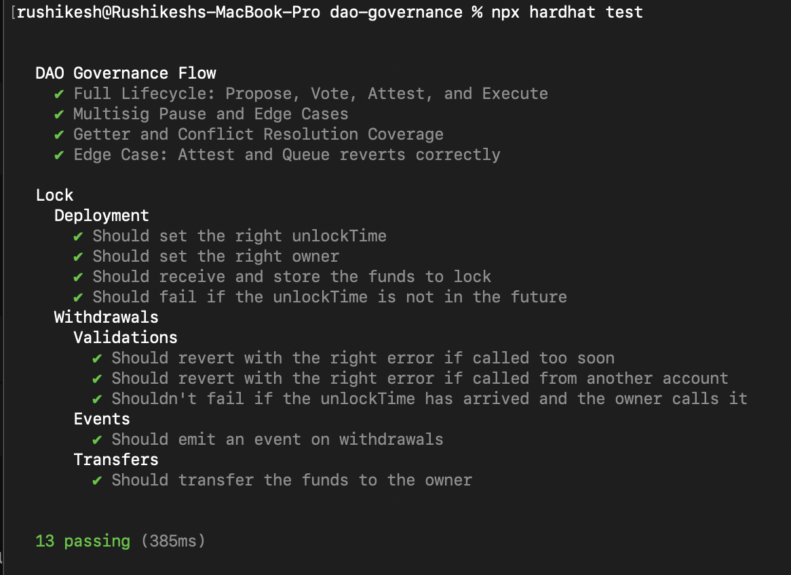
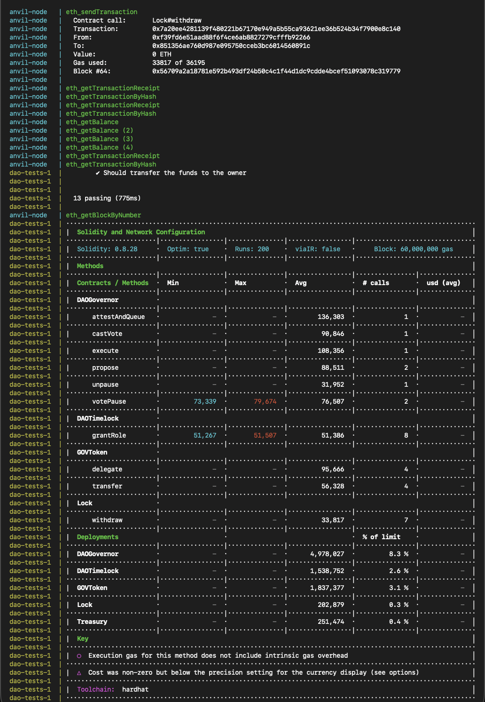
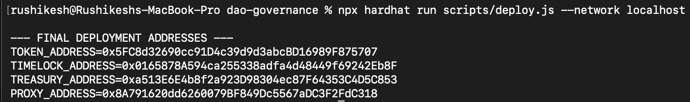
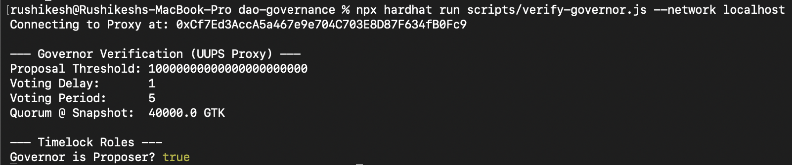
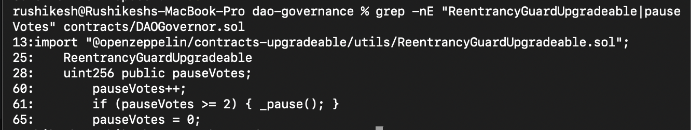

# Hardened DAO Governance System (UUPS & Multisig Enabled)

## Overview

This repository contains a production-grade DAO governance framework designed and implemented on an EVM-compatible blockchain. The system supports the complete governance lifecycle — proposal creation, voting, quorum enforcement, timelocked execution, emergency controls, off-chain vote attestation, and upgradeability — using OpenZeppelin’s audited contracts and Hardhat tooling.

The project is intentionally built to be secure, modular, reproducible, and evaluator-friendly, with all interactions demonstrated via scripts and terminal commands.

---

## Key Features

- ERC20Votes-based governance token with delegation & snapshot voting
- Governor contract with configurable voting delay, voting period, and quorum
- TimelockController enforced execution for all successful proposals
- Treasury owned exclusively by the Timelock (DAO-controlled)
- 2-of-N multisig-style emergency pause mechanism
- Off-chain voting attestation bridge
- UUPS proxy-based upgradeability
- Full Docker-based reproducible environment
- Comprehensive unit tests with high coverage

---

## Architecture

### Core Contracts

- GOVToken  
  ERC-20 governance token built using ERC20Votes and ERC20Permit.  
  Supports delegation, historical vote snapshots, and gas-efficient voting.

- DAOGovernor (UUPS Proxy)  
  Central governance logic handling proposals, voting, quorum checks, queueing, and execution.  
  Integrates emergency pause logic, off-chain vote attestation, and upgrade authorization.

- DAOTimelock  
  Enforces a mandatory delay before proposal execution.  
  Governor is the sole proposer; execution is permissionless after delay.

- Treasury  
  Holds ETH and can only be executed by the Timelock, ensuring DAO-only control over funds.

### Architectural Rationale

- UUPS vs Transparent Proxy  
  UUPS was chosen for lower deployment gas costs and cleaner separation of upgrade logic.

- Timelock Dependency  
  The Treasury is owned by the Timelock, not an EOA, ensuring no single party can bypass governance.

- 2-of-N Pause Logic  
  Emergency pause requires votes from multiple authorized pausers, simulating multisig security.

- Hybrid Governance  
  Off-chain voting is bridged on-chain using a controlled attestation mechanism.

---

## Deployed Addresses (Local Hardhat Network)

- Deployer: 0xf39fd6e51aad88f6f4ce6ab8827279cfffb92266
- GOVToken: 0x5fbdb2315678afecb367f032d93f642f64180aa3
- DAOTimelock: 0xe7f1725e7734ce288f8367e1bb143e90bb3f0512
- DAOGovernor (Proxy): 0xDc64a140Aa3E981100a9becA4E685f962f0cF6C9
- Treasury: 0x9fe46736679d2d9a65f0992f2272de9f3c7fa6e0

Network: Hardhat local (Anvil-compatible)

---

## Setup & Execution

### Docker (Recommended)

docker-compose up --build --abort-on-container-exit

### Local

npx hardhat compile  
npx hardhat test  
npx hardhat coverage  

---

## Screenshots

### 1. Code Coverage (97% Lines)

### 2. Full Test Suite Results

### 3. Containerized Verification (Docker)

### 4. UUPS Proxy Deployment

### 5. DAO Threshold & Role Status

### 6. Security Hardening (Reentrancy & Multisig)

---

## License

MIT

---
